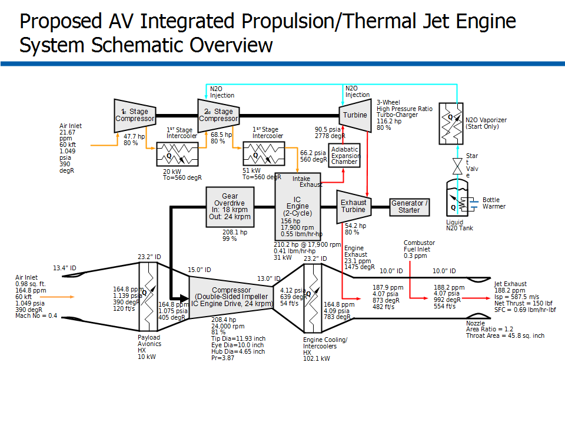
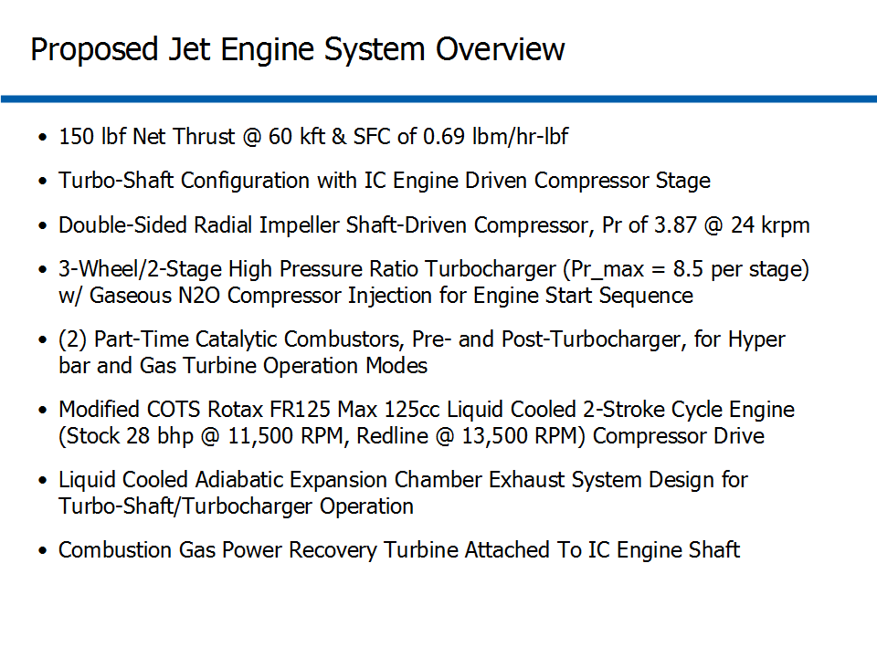
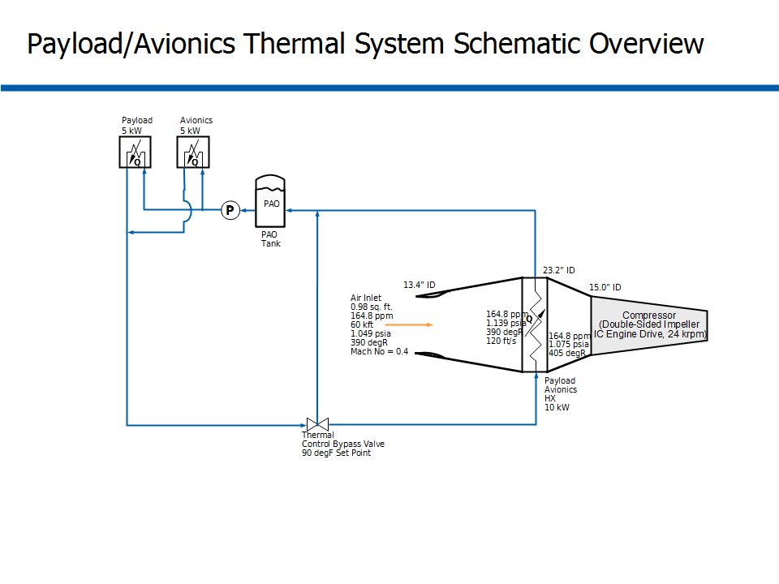
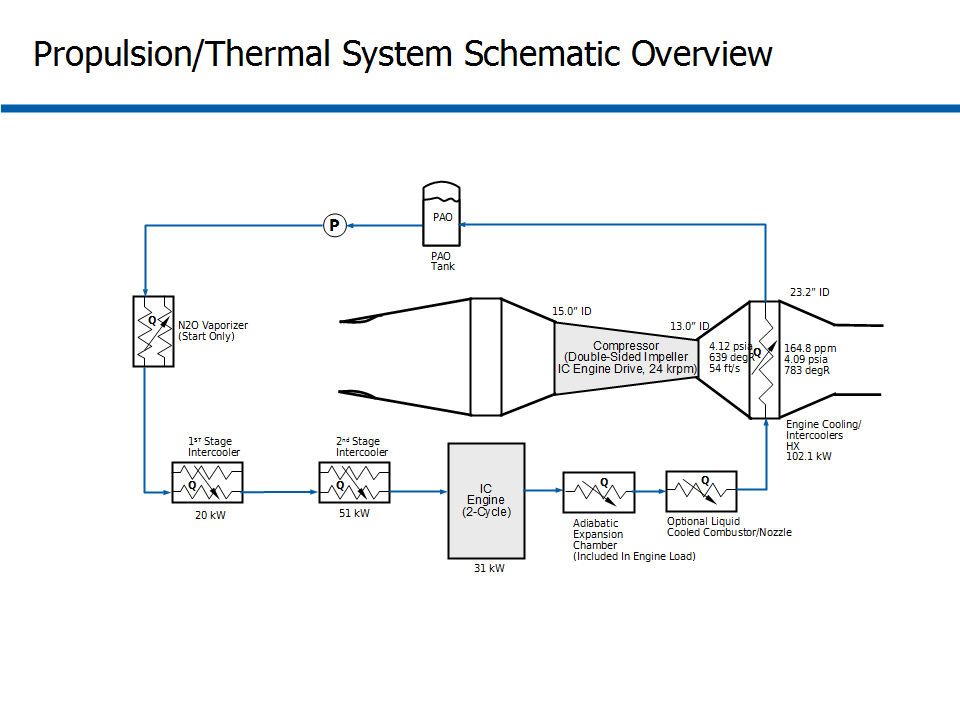
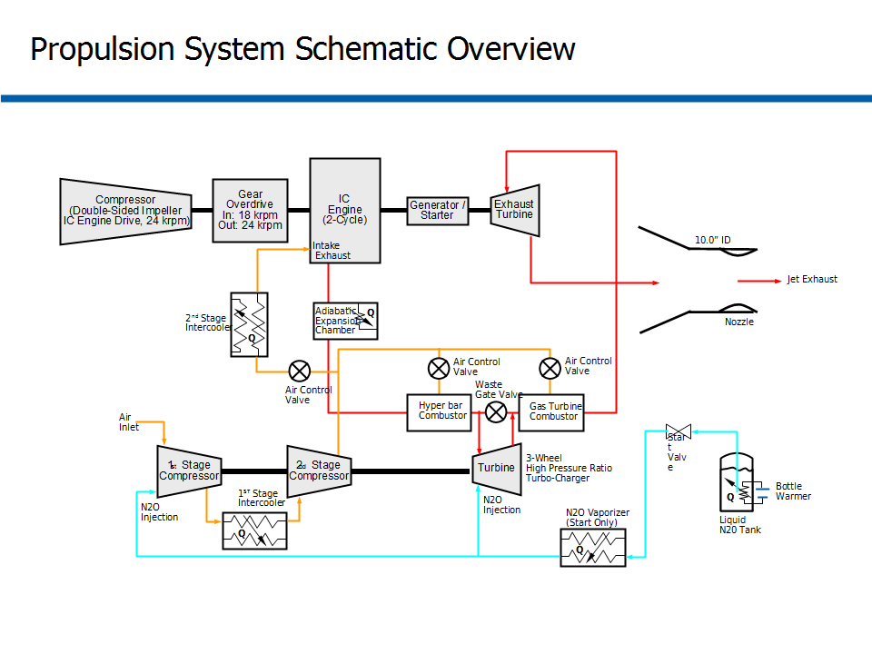
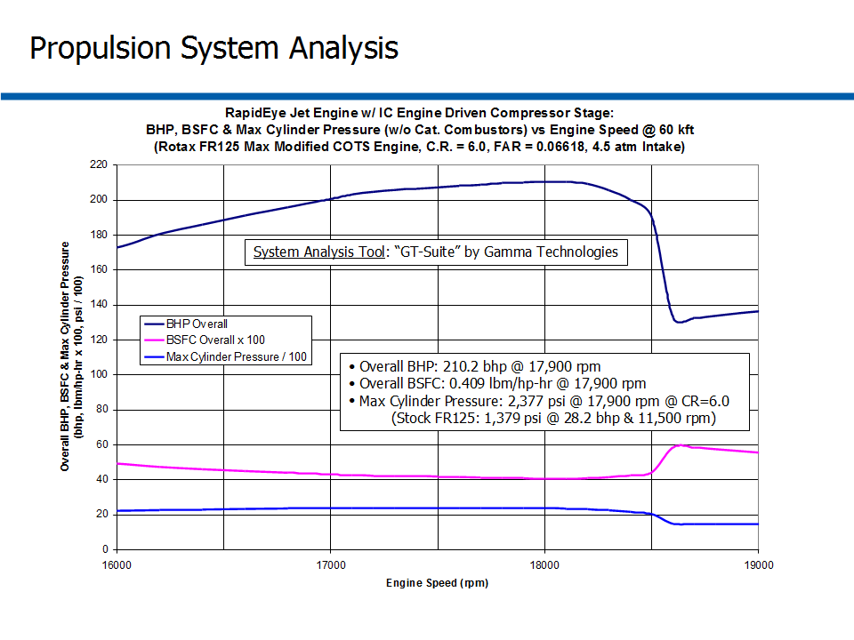

# ========================================
# Air Vehicle Integrated Propulsion 0kft to 60kft Altitude Operation Optimization:
# ========================================

## I. Design Context Overview:

## 
## 
## II. Integrated Propulsion/Thermal System Schematic Diagram:

## 
## 
## III. Overview of Hybrid Jet Engine System:

## 
## 
## IV. Overview of Payload/Avionics Thermal System Schematic:

## 
## 
## V. Overview of Propulsion/Thermal System Schematic:

## 
## 
## VI. Overview of Propulsion System Schematic:

## 
## 
## VII. Modified COTS IC Engine:

## 
## 
## VIII. ICE Sub-System Analysis:

## 
## 
## IX. Overview of Adiabatic/Choked 3-Stage Expansion Chamber Design:

## 
## 
## X. Overview of Modified COTS IC Engine Sub-System:

## 
## *Note: Performance Data and Analysis performed using "GT-Suite", Gamma Technologies Inc.